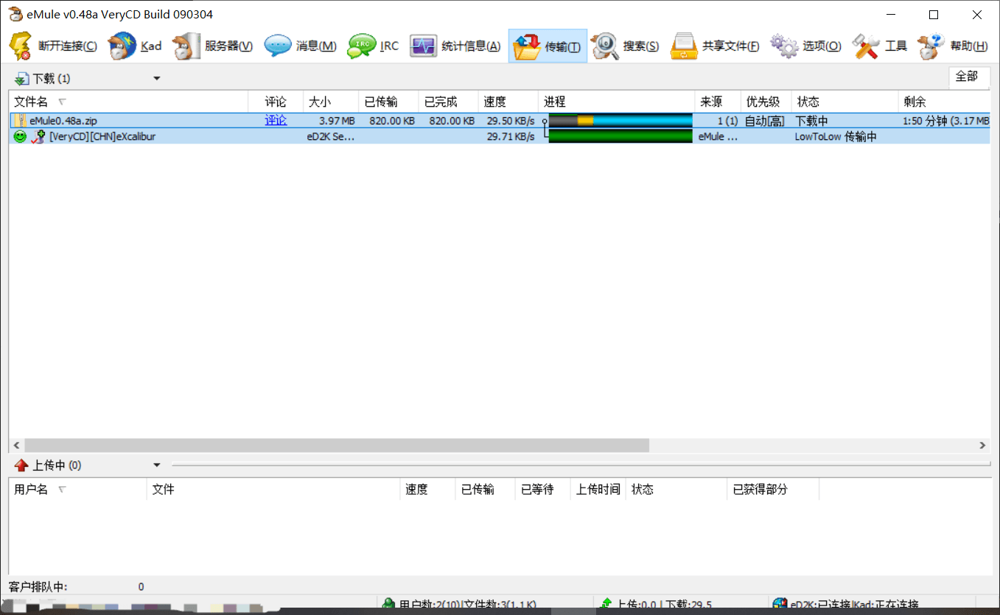

# eNode-go

Go port of the original `eNode` eD2K/eMule server codebase.

[中文说明](README.zh-CN.md)

Protocol doc: [Server <=> Client Communication (OP_ meanings)](docs/server-client-communication.md)

## Included

- Core eD2K protocol modules (`ed2k/*`)
- Runtime entrypoint (`cmd/enode/main.go`)
- YAML config loader (`config/*`)
- Storage engines:
  - `memory`
  - `mysql` (real `database/sql` + `go-sql-driver/mysql`)
  - `mongodb` (real official MongoDB Go driver)
- Unit tests for core modules
- Dockertest integration tests for real MySQL/Mongo backends

## Features

- TCP/UDP opcodes
- TCP/UDP protocol obfuscation
- Obfuscated lowID detection
- Lugdunum/eMule extended protocol
- gzip compression
- LowID callbacks
- NAT traversal server (`OP_VC_NAT_HEADER`, `OP_NAT_REGISTER`, `OP_NAT_SYNC2`)
- Files larger than 4 GiB
- Easy support for multiple storage engines

## NAT Traversal Transfer Screenshot



## Configuration

Runtime config is YAML:

- `enode.config.yaml`

Start command supports custom path:

```bash
go run ./cmd/enode -config enode.config.yaml
```

Important config section:

```yaml
storage:
  engine: memory   # memory | mysql | mongodb

natTraversal:
  enabled: true
  port: 2004
  registrationTTLSeconds: 600
```

For MySQL:

```yaml
storage:
  engine: mysql
  mysql:
    host: localhost
    port: 3306
    user: enode
    pass: password
    database: enode
    connections: 8
```

For MongoDB:

```yaml
storage:
  engine: mongodb
  mongodb:
    uri: mongodb://localhost:27017
    database: enode
```

## Build & Test

Run all standard tests:

```bash
go test ./...
```

Run real DB integration tests (Docker required):

```bash
ENODE_INTEGRATION=1 go test ./storage -run Dockertest -v
```

This spins temporary MySQL and MongoDB containers, initializes schema/data, and verifies backend behavior end-to-end.

## To Do

- Better storage/indexing
- IPv6 support ([unofficial draft for eD2K IPv6 extension](http://piratenpad.de/p/ed2kIPv6))

## Thanks To

- David Xanatos

## Notes

- The original Node.js repository remains separate; this directory is the Go implementation.
- If Docker is unavailable, integration tests are skipped unless explicitly enabled.
